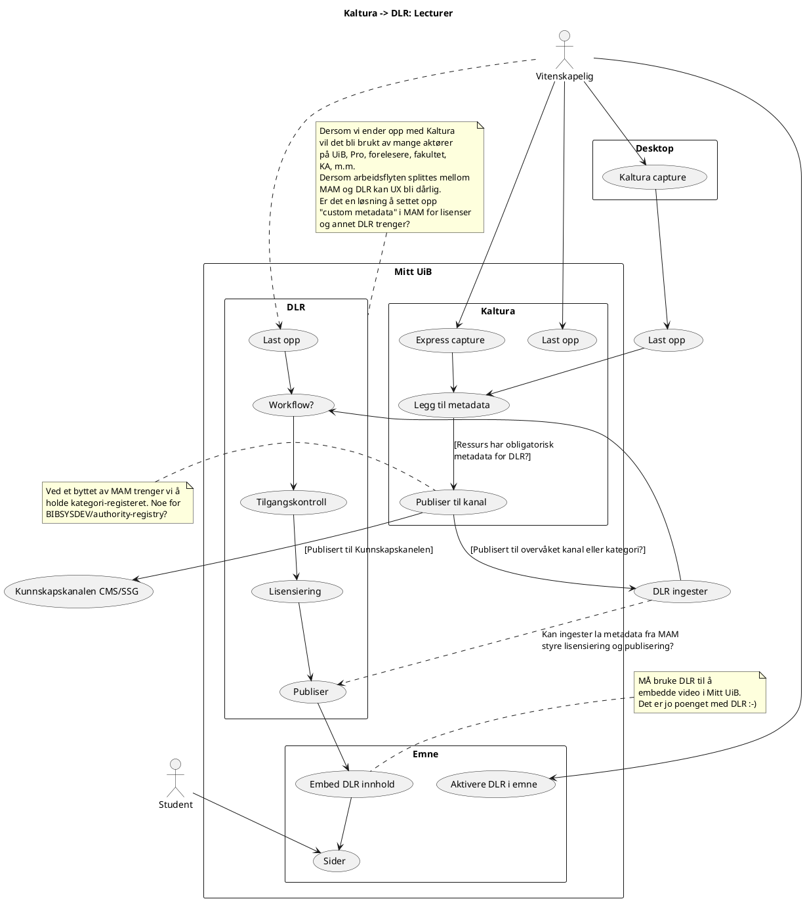

```plantuml 
@startuml

title Kaltura -> DLR: Lecturer

rectangle Desktop {
    (Kaltura capture)
}

rectangle "Mitt UiB" as mittuib {
    rectangle Kaltura {
        (Last opp) as kupload
        (Express capture) 
        (Legg til metadata) as metadata
        (Publiser til kanal) as channel
    }

    rectangle DLR {
        (Last opp) as dlrupload
        (Tilgangskontroll) as access
        (Lisensiering) as license
        (Publiser) as publish
        (Workflow?) as wf
    }
    rectangle Emne {
        (Aktivere DLR i emne) as activate
        (Sider) as sider
        (Embed DLR innhold) as ltidlr
    }
}

:Vitenskapelig: as Lecturer
:Student: as Student

Lecturer --> kupload
Lecturer ..> dlrupload
dlrupload --> wf
Lecturer --> (Kaltura capture)
Lecturer --> (Express capture) 
(Kaltura capture) --> (Last opp)
(Last opp) --> metadata
(Express capture) --> metadata
metadata --> channel : "[Ressurs har obligatorisk \lmetadata for DLR?]"

channel --> (DLR ingester) : "[Publisert til overvåket kanal eller kategori?]"
channel --> (Kunnskapskanalen CMS/SSG) : "[Publisert til Kunnskapskanelen]"
(DLR ingester) --> wf
(DLR ingester) ..> publish : "Kan ingester la metadata fra MAM\lstyre lisensiering og publisering?"
publish --> ltidlr

Lecturer --> activate

note top of ltidlr
    MÅ bruke DLR til å
    embedde video i Mitt UiB.
    Det er jo poenget med DLR :-)
end note

wf --> access
access --> license
license --> publish

ltidlr --> sider

Student --> sider

note top of DLR 
    Dersom vi ender opp med Kaltura
    vil det bli brukt av mange aktører
    på UiB, Pro, forelesere, fakultet,
    KA, m.m.
    Dersom arbeidsflyten splittes mellom
    MAM og DLR kan UX bli dårlig.
    Er det en løsning å settet opp 
    "custom metadata" i MAM for lisenser 
    og annet DLR trenger?
end note

note left of channel
    Ved et byttet av MAM trenger vi å
    holde kategori-registeret. Noe for 
    BIBSYSDEV/authority-registry?
end note
@enduml
```