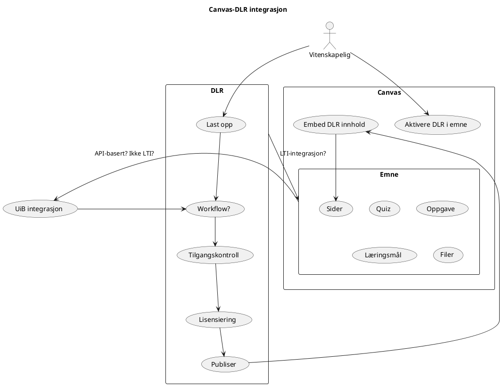

En gjenganger i alle diskusjoner med fagmiljø og prosjekter er ønsket om å dele læringsressurser og læringsobjekt fra Canvas. Det virker som det er viktigere for de, enn deling av ressursene i seg selv via DLR.

