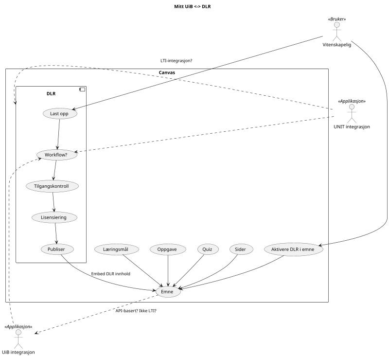

En gjenganger i alle diskusjoner med fagmiljø og prosjekter er ønsket om å dele læringsressurser og læringsobjekt fra Canvas til DLR. Det virker som det er viktigere for de, enn bruk av ressursene i DLR i emner.

## Avklaringer
* Hvem skal bygge en integrasjon mellom OSS Canvas og DLR, dersom man beslutter at læringsobjekter skal kunne deles med andre i sektoren?
* Ønske om en slags fagfellevurdering av de beste ressursene, best-practise oversikt. Se [overlay tidsskrift](https://en.wikipedia.org/wiki/Overlay_journal) for inspirasjon.

## Diagram 

