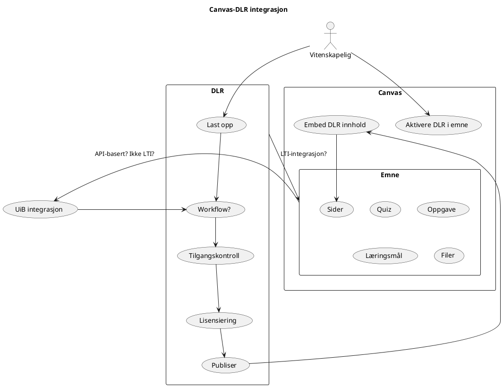

```plantuml 
@startuml

title Canvas-DLR integrasjon


rectangle DLR {
    (Last opp) as dlrupload
    (Tilgangskontroll) as access
    (Lisensiering) as license
    (Publiser) as publish
    (Workflow?) as wf
}

rectangle Canvas {
    (Aktivere DLR i emne) as activate
    (Embed DLR innhold) as ltidlr
    rectangle Emne { 
        (Sider) as sider
        (Quiz)
        (Oppgave)
        (Læringsmål)
        (Filer)
    }
}


:Vitenskapelig: as Lecturer

Lecturer --> dlrupload
dlrupload --> wf
publish --> ltidlr
wf --> access
access --> license
license --> publish

Lecturer --> activate

DLR --> Emne : "LTI-integrasjon?"

ltidlr --> sider

Emne --> (UiB integrasjon) : "API-basert? Ikke LTI?"
(UiB integrasjon) -> wf

@enduml
```