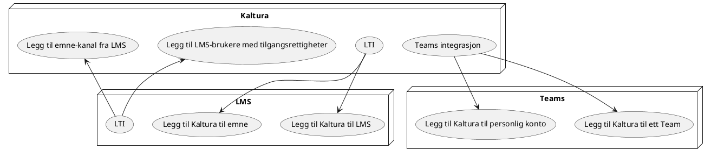

En overordnet skisse over hvor mediafiler blir lagret.

* MAM levert av NORDU.net har ingen kostnader knyttet til båndbredde.
* NORDUnet kan fasilitere diskusjon på slettepolitikk.
  * Kaltura og Panopto har innstillinger for slettepolitikk. 

## Lagring av mediafiler

## Integrasjoner med Teams og Canvas

<iframe id="kaltura_player" src="https://cdnapisec.kaltura.com/p/2249861/sp/224986100/embedIframeJs/uiconf_id/38665202/partner_id/2249861?iframeembed=true&playerId=kaltura_player&entry_id=0_oxpqe36g&flashvars[streamerType]=auto&amp;flashvars[localizationCode]=en_BE&amp;flashvars[leadWithHTML5]=true&amp;flashvars[sideBarContainer.plugin]=true&amp;flashvars[sideBarContainer.position]=left&amp;flashvars[sideBarContainer.clickToClose]=true&amp;flashvars[chapters.plugin]=true&amp;flashvars[chapters.layout]=vertical&amp;flashvars[chapters.thumbnailRotator]=false&amp;flashvars[streamSelector.plugin]=true&amp;flashvars[EmbedPlayer.SpinnerTarget]=videoHolder&amp;flashvars[dualScreen.plugin]=true&amp;flashvars[hotspots.plugin]=1&amp;flashvars[Kaltura.addCrossoriginToIframe]=true&amp;&wid=1_ay6l5uhf" width="608" height="402" allowfullscreen webkitallowfullscreen mozAllowFullScreen allow="autoplay *; fullscreen *; encrypted-media *" sandbox="allow-forms allow-same-origin allow-scripts allow-top-navigation allow-pointer-lock allow-popups allow-modals allow-orientation-lock allow-popups-to-escape-sandbox allow-presentation allow-top-navigation-by-user-activation" frameborder="0" title="Kaltura Player" style="position:absolute;top:0;left:0;width:100%;height:100%"></iframe>

### "Scheduled" opptak

https://knowledge.kaltura.com/help/kaltura-scheduling-administrators-guide
https://knowledge.kaltura.com/help/kaltura-recording-scheduling-management
https://knowledge.kaltura.com/help/scheduling-management---adding-events