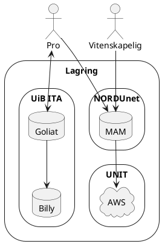
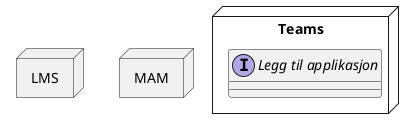

En overordnet skisse over hvor mediafiler blir lagret.

* MAM levert av NORDU.net har ingen kostnader knyttet til båndbredde.
* NORDUnet kan fasilitere diskusjon på slettepolitikk.
  * Kaltura og Panopto har innstillinger for slettepolitikk. 

## Lagring av mediafiler

## Integrasjoner

