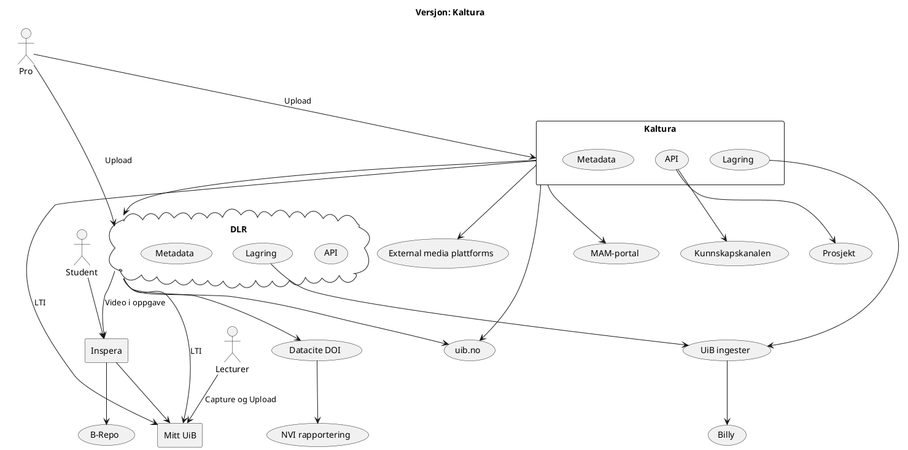

```plantuml 
@startuml

title Versjon: Kaltura

:Pro:
:Lecturer:
:Student:

rectangle Kaltura {
    (API) as kapi
    (Lagring) as kstorage
    (Metadata) as kmetadata
}

cloud DLR {
    (API) as dapi
    (Lagring) as dstorage
    (Metadata) as dmetadata
}

rectangle "Mitt UiB" as LMS {
}

rectangle Inspera {
}

(MAM-portal) as portal

:Lecturer: --> LMS : "Capture og Upload"
:Pro: --> Kaltura : "Upload"
:Pro: --> DLR : "Upload"
Kaltura --> portal
Kaltura --> DLR
Kaltura --> LMS : LTI
Kaltura --> (External media plattforms)
Kaltura --> (uib.no)
DLR --> (uib.no)
kapi --> (Kunnskapskanalen)
kapi --> (Prosjekt)

kstorage --> (UiB ingester)
dstorage --> (UiB ingester)
(UiB ingester) --> (Billy)

DLR --> LMS : LTI
DLR --> (Datacite DOI)
(Datacite DOI) --> (NVI rapportering)
DLR --> Inspera : Video i oppgave
Inspera --> (B-Repo)
:Student: --> Inspera
Inspera --> LMS
@enduml
```

