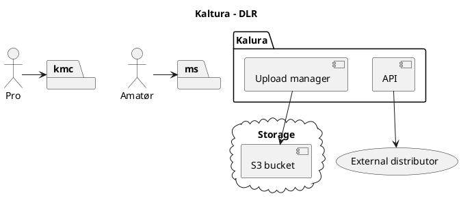

```plantuml
@startuml

title Kaltura - DLR

Pro -> kmc
Amatør -> ms

(External distributor) as extDist

cloud "Storage" as s3 {
  [S3 bucket] as bucket
}

package "Kalura" as k {
  [Upload manager] as uploadMng
  uploadMng --> bucket
  [API] as api 
  api --> extDist
  
  package "KMC" as kmc {
    
  }
  
  package "Mediaspace" as ms {
    
  }
}

@enduml
```