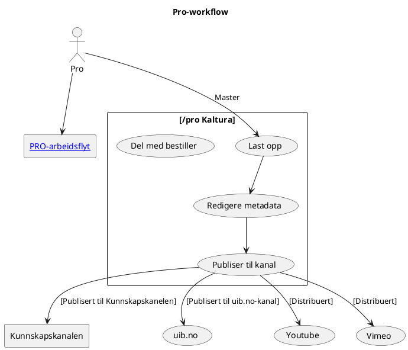

```plantuml 
@startuml

title Pro-workflow

rectangle "[[/pro-workflow PRO-arbeidsflyt]]" as prowf {

}

rectangle "[[/pro Kaltura]]" {
    (Last opp)
    (Redigere metadata) as metadata
    (Del med bestiller)
    (Publiser til kanal) as channel
}

rectangle Kunnskapskanalen as kk {

}

:Pro:

Pro --> prowf

Pro --> (Last opp) : Master
(Last opp) --> metadata
metadata --> channel

channel --> kk : "[Publisert til Kunnskapskanelen]"
channel --> (uib.no) : "[Publisert til uib.no-kanal]"
channel --> (Youtube) : "[Distribuert]"
channel --> (Vimeo) : "[Distribuert]"

@enduml
```