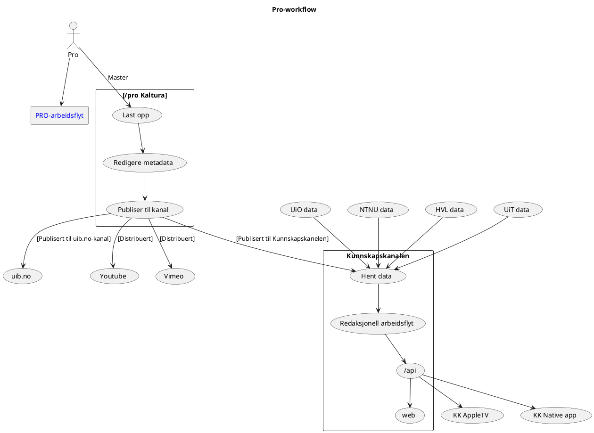

```plantuml 
@startuml

title Pro-workflow

rectangle "[[/pro-workflow PRO-arbeidsflyt]]" as prowf {

}

rectangle "[[/pro Kaltura]]" {
    (Last opp)
    (Redigere metadata) as metadata
    (Publiser til kanal) as channel
}

rectangle Kunnskapskanalen as kk {
    (Hent data) as source
    (Redaksjonell arbeidsflyt)
    (/api)
    (web)
}

:Pro:

Pro --> prowf

Pro --> (Last opp) : Master
(Last opp) --> metadata
metadata --> channel

channel --> source : "[Publisert til Kunnskapskanelen]"
channel --> (uib.no) : "[Publisert til uib.no-kanal]"
channel --> (Youtube) : "[Distribuert]"
channel --> (Vimeo) : "[Distribuert]"

(UiO data) --> source
(NTNU data) --> source
(HVL data) --> source
(UiT data) --> source

source --> (Redaksjonell arbeidsflyt)
(Redaksjonell arbeidsflyt) --> (/api)

(/api) --> web
(/api) --> (KK AppleTV)
(/api) --> (KK Native app)

@enduml
```