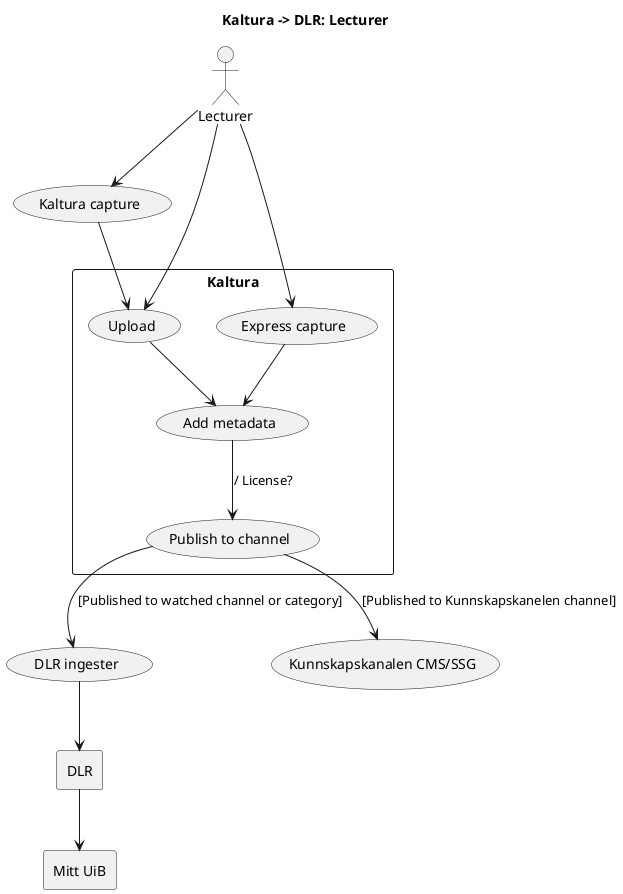

```plantuml 
@startuml

title Kaltura -> DLR: Lecturer

rectangle Kaltura {
    (Upload)
    (Express capture) 
    (Add metadata) as metadata
    (Publish to channel) as channel
}

rectangle DLR {

}

rectangle "Mitt UiB" as mittuib {

}

:Lecturer: 

Lecturer --> (Upload)
Lecturer --> (Kaltura capture)
Lecturer --> (Express capture) 
(Kaltura capture) --> (Upload)
(Upload) --> metadata
(Express capture) --> metadata
metadata --> channel : / License?

channel --> (DLR ingester) : "[Published to watched channel or category]"
channel --> (Kunnskapskanalen CMS/SSG) : "[Published to Kunnskapskanelen channel]"
(DLR ingester) --> DLR
DLR --> mittuib
@enduml
```