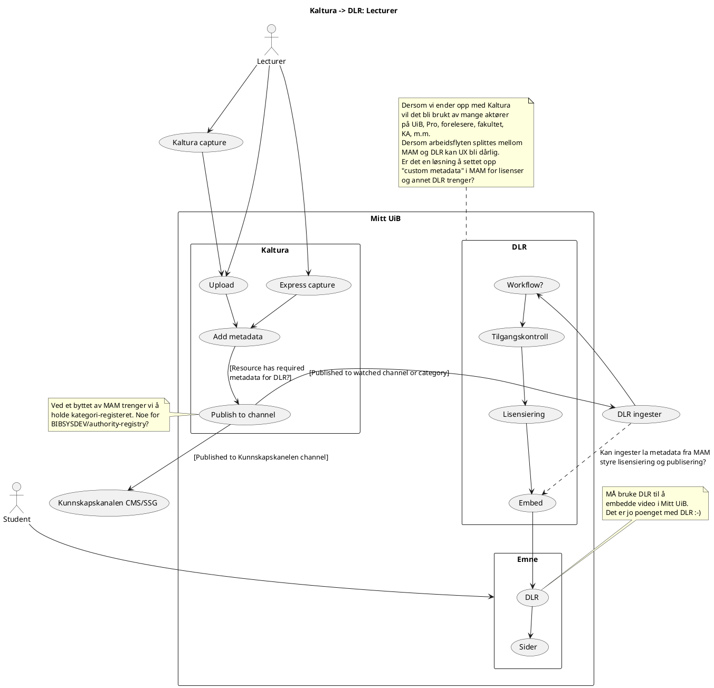

```plantuml 
@startuml

title Kaltura -> DLR: Lecturer

rectangle "Mitt UiB" as mittuib {
    rectangle Kaltura {
        (Upload)
        (Express capture) 
        (Add metadata) as metadata
        (Publish to channel) as channel
    }

    rectangle DLR {
        (Tilgangskontroll) as access
        (Lisensiering) as license
        (Embed) as embed
        (Workflow?) as wf
    }
    rectangle Emne {
        (Sider) as sider
        (DLR) as ltidlr
    }
}

:Lecturer: 
:Student: 

Lecturer --> (Upload)
Lecturer --> (Kaltura capture)
Lecturer --> (Express capture) 
(Kaltura capture) --> (Upload)
(Upload) --> metadata
(Express capture) --> metadata
metadata --> channel : "[Resource has required\lmetadata for DLR?]"

channel --> (DLR ingester) : "[Published to watched channel or category]"
channel --> (Kunnskapskanalen CMS/SSG) : "[Published to Kunnskapskanelen channel]"
(DLR ingester) --> wf
(DLR ingester) ..> embed : "Kan ingester la metadata fra MAM\lstyre lisensiering og publisering?"
embed --> ltidlr

note top of ltidlr
    MÅ bruke DLR til å
    embedde video i Mitt UiB.
    Det er jo poenget med DLR :-)
end note

wf --> access
access --> license
license --> embed

ltidlr --> sider

:Student: --> Emne

note top of DLR 
    Dersom vi ender opp med Kaltura
    vil det bli brukt av mange aktører
    på UiB, Pro, forelesere, fakultet,
    KA, m.m.
    Dersom arbeidsflyten splittes mellom
    MAM og DLR kan UX bli dårlig.
    Er det en løsning å settet opp 
    "custom metadata" i MAM for lisenser 
    og annet DLR trenger?
end note

note left of channel
    Ved et byttet av MAM trenger vi å
    holde kategori-registeret. Noe for 
    BIBSYSDEV/authority-registry?
end note
@enduml
```