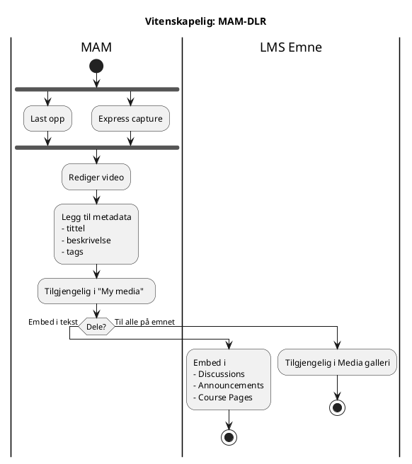
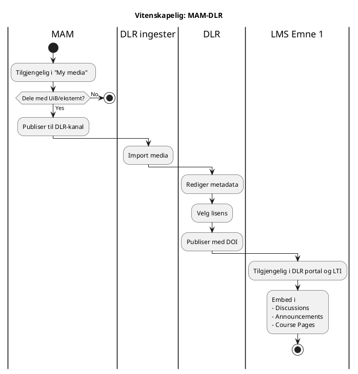
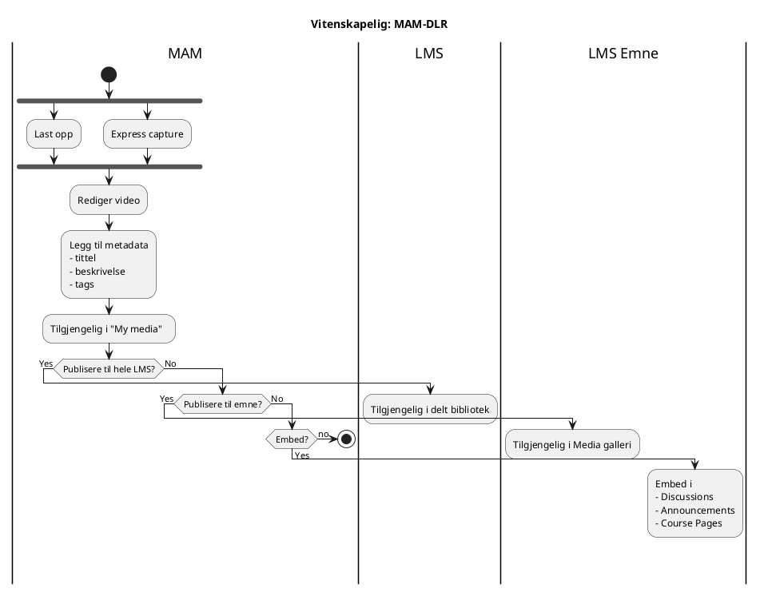
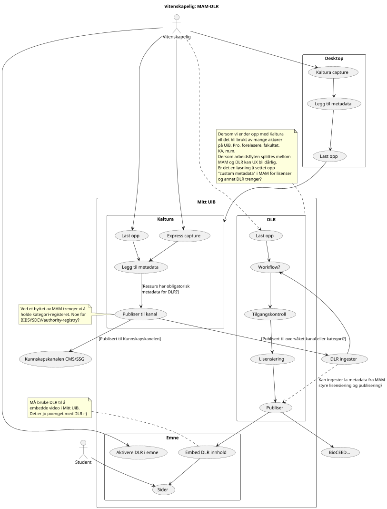
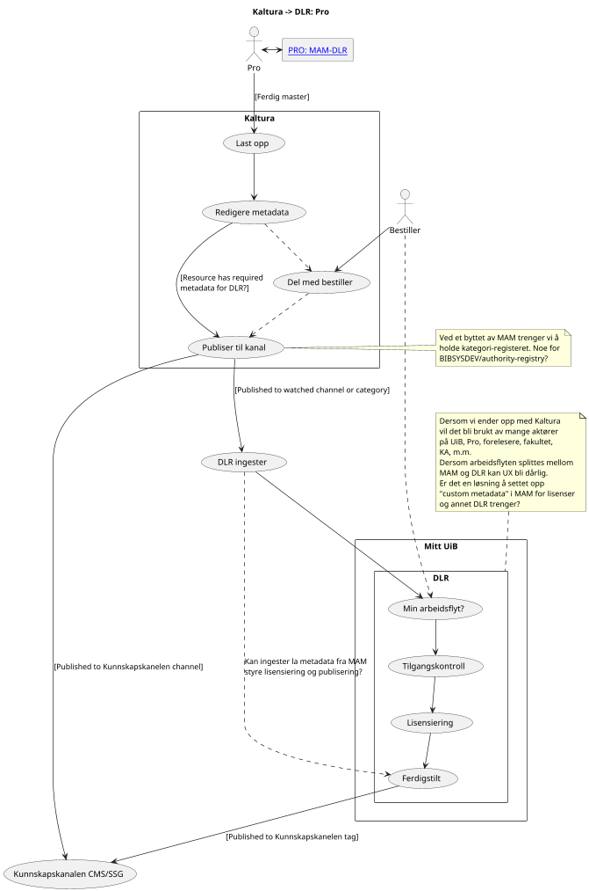

## Dele video lukket i emne eller LMS uten bruk av DLR

Integrasjon av MAM i LMS kan benyttes til å dele video lukket i MAM og i emner. Kaltura kan settes opp slik at LMS lager egne samlinger basert på emnene som holdes. Forelesere og studenter kan dele video lukket i det emnet. Dette kan være nyttig for å gi studenter video-tilbakemeldinger.

Disse videoene vil kunne regnes som flyktige og bli slettet automatisk, med mindre de har blitt publisert til DLR og/eller en kanal.

-> Spørsmål: Video som har blitt tilgjengeliggjort i emnegalleriet og publisert, vil de kunne bli slettet selv om de skal tas vare på?

## Publisere video i DLR

## Alternativ der DLR overvåker en MAM-kanal

### Alternativ der MAM deler til hele LMS

## Brukstilfelle - Vitenskapelig: MAM-DLR

