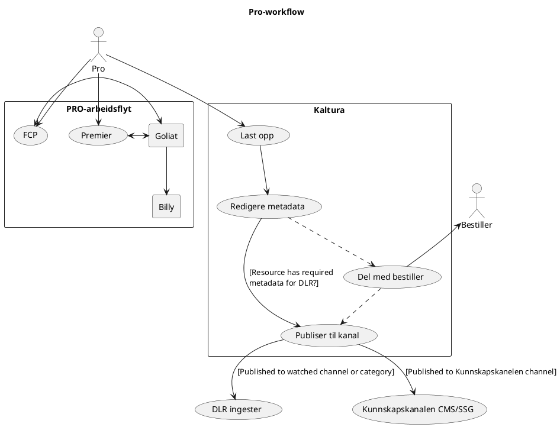

```plantuml 
@startuml

title Pro-workflow

rectangle "PRO-arbeidsflyt" as pro-wf {
    (FCP)
    (Premier)

    rectangle Goliat {

    }

    rectangle Billy {

    }
}

rectangle Kaltura {
    (Last opp)
    (Redigere metadata) as metadata
    (Del med bestiller)
    (Publiser til kanal) as channel
}

:Pro:
:Bestiller:

Bestiller <-- (Del med bestiller)

Pro --> (FCP)
(FCP) <-> Goliat
Pro --> (Premier)
(Premier) <-> Goliat

Goliat --> Billy

Pro --> (Last opp)
(Last opp) --> metadata
metadata ..> (Del med bestiller)
(Del med bestiller) ..> channel
metadata --> channel : "[Resource has required\lmetadata for DLR?]"

channel --> (DLR ingester) : "[Published to watched channel or category]"
channel --> (Kunnskapskanalen CMS/SSG) : "[Published to Kunnskapskanelen channel]"

@enduml
```