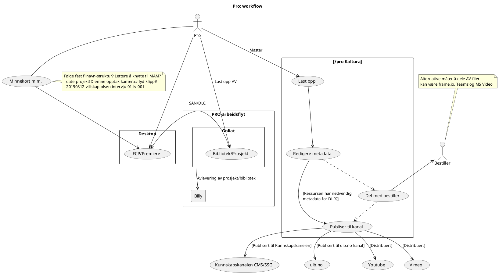
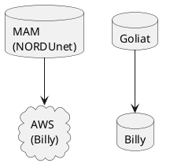

Frame.io sitt dokument på arbeidsflyt er interessant lesning: https://workflow.frame.io/guide.

Dette er en amatørs første forsøk på å forstå en pro workflow under produksjon. Ikke men som noe normativt, men et forsøk på å se formidlingen av råopptak til de som måtte ønske å se de for forskningsformål, gjenbruk i nye produksjoner o.l.

