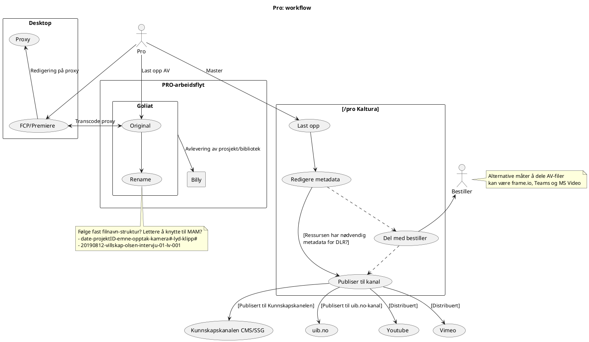

Frame.io sitt dokument på arbeidsflyt er interessant lesning: https://workflow.frame.io/guide.

```plantuml 
@startuml

title Pro: workflow

rectangle Desktop {
    (FCP/Premiere)
    (Proxy)
}

rectangle "PRO-arbeidsflyt" as prowf {
    rectangle Goliat {
        (Original)
        (Rename)
    }

    rectangle Billy {

    }
}

rectangle "[[/pro Kaltura]]" {
    (Last opp)
    (Redigere metadata) as metadata
    (Del med bestiller)
    (Publiser til kanal) as channel
}

:Pro:
:Bestiller:

Bestiller <-- (Del med bestiller)

Pro --> Original : "Last opp AV"
Original --> Rename

Pro --> (FCP/Premiere)
Proxy <-- (FCP/Premiere) : "Redigering på proxy"
(FCP/Premiere) <-> Original : "Transcode proxy"

Goliat --> Billy : Avlevering av prosjekt/bibliotek

Pro --> (Last opp) : Master
(Last opp) --> metadata
metadata ..> (Del med bestiller)
(Del med bestiller) ..> channel
metadata --> channel : "[Ressursen har nødvendig \lmetadata for DLR?]"

channel --> (Kunnskapskanalen CMS/SSG) : "[Publisert til Kunnskapskanelen]"
channel --> (uib.no) : "[Publisert til uib.no-kanal]"
channel --> (Youtube) : "[Distribuert]"
channel --> (Vimeo) : "[Distribuert]"

note bottom of Rename
    Følge fast filnavn-struktur? Lettere å knytte til MAM?
    - date-projektID-emne-opptak-kamera#-lyd-klipp#
    - 20190812-villskap-olsen-intervju-01-lv-001
end note

note right of Bestiller 
    Alternative måter å dele AV-filer
    kan være frame.io, Teams og MS Video
end note
@enduml
```