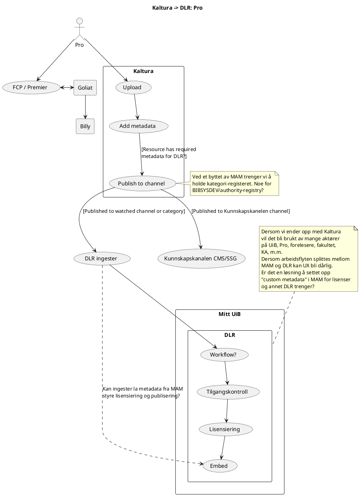

```plantuml 
@startuml

title Kaltura -> DLR: Pro

rectangle Goliat {

}

rectangle Billy {

}

rectangle Kaltura {
    (Upload)
    (Add metadata) as metadata
    (Publish to channel) as channel
}

rectangle "Mitt UiB" as mittuib {
    rectangle DLR {
        (Tilgangskontroll) as access
        (Lisensiering) as license
        (Embed) as embed
        (Workflow?) as wf
    }
}

:Pro: 

Pro --> (FCP / Premier)
(FCP / Premier) <-> Goliat
Goliat --> Billy

Pro --> (Upload)
(Upload) --> metadata
metadata --> channel : "[Resource has required\lmetadata for DLR?]"

channel --> (DLR ingester) : "[Published to watched channel or category]"
channel --> (Kunnskapskanalen CMS/SSG) : "[Published to Kunnskapskanelen channel]"
(DLR ingester) --> wf
(DLR ingester) ..> embed : "Kan ingester la metadata fra MAM\lstyre lisensiering og publisering?"

wf --> access
access --> license
license --> embed

note top of DLR 
    Dersom vi ender opp med Kaltura
    vil det bli brukt av mange aktører
    på UiB, Pro, forelesere, fakultet,
    KA, m.m.
    Dersom arbeidsflyten splittes mellom
    MAM og DLR kan UX bli dårlig.
    Er det en løsning å settet opp 
    "custom metadata" i MAM for lisenser 
    og annet DLR trenger?
end note

note left of channel
    Ved et byttet av MAM trenger vi å
    holde kategori-registeret. Noe for 
    BIBSYSDEV/authority-registry?
end note
@enduml
```